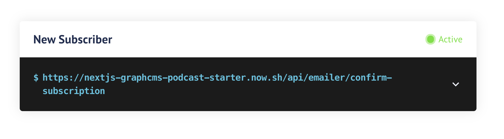

# GraphCMS Podcast Demo

> Minimalist podcast website built with GraphCMS, Next.js, Vercel, and Twillio Sendgrid.

[Read more](https://graphcms.com/blog/build-a-podcast-with-graphcms-and-the-serverless-stack)

## The stack

Podcasts are a great way to get start an indie movement, build a loyal user base or simply get your message out. But many times, the "off the shelf" solutions are slightly overly simplistic, are difficult to customize or suffer from being drowned out on centralized platforms. Using a headless CMS, you can create a completely unique experience, tailored to your exact needs.

- **[GraphCMS](https://graphcms.com)**: Manages the shows, subscribers and newsletters.
- **[Next.js](https://nextjs.org/)**: Acts as a powerful framework that lets us query for live data and use serverless functions in Now.
- **[Vercel](https://vercel.com/)**: A static host that also supports Lambda functions where we handle our subscriptions, unsubscribes and new RSS generation.
- **[Sendgrid](https://sendgrid.com)**: Sending notification emails for confirmation.

## How it works

1. GraphCMS will house our entire content architecture. We will discuss the architecture in further detail at the connected blog post. The rough structure (though not hierarchial) looks like this: Episodes -> (Sponsors | Audio | Hosts | Guests) | Subscribers | Feeds | Sponsors

2. Next.js will power our application where we fetch content from GraphCMS (through a GraphQL proxy that authenticates our GraphCMS endpoint, hosted locally in a lambda function).

3. The "Subscribe/Unsubscribe" function is handled server-side in a lambda, executed by now. This will sign a user up to be notified of new episodes.

4. GraphCMS will kick off a Webhook on subscriber creation to another Now hosted endpoint that will send a confirmation email through Sendgrid to the subscriber.

5. In the email to the subscriber, a link will be exposed where they can confirm their subscription, again through a function hosted in Now, for the "double opt-in" that's become an industry standard.

⚠️ You need to have an account and API keys for Sendgrid for this to work.

## How to use

If you wish to extend and work with this example locally, follow the instructions below.

If you'd rather check out a [demo](https://nextjs-graphcms-podcast-starter.now.sh/) or deploy to your own Now account, you can do that too.

First, you will need accounts at GraphCMS, Sendgrid and Now.

### 1. Download and install dependencies

```bash
git clone git@github.com:github.com/GraphCMS/nextjs-graphcms-podcast-starter.git
cd nextjs-graphcms-podcast-starter
yarn # npm install
cp .env.buld.sample .env.build
cp .env.sample .env
```

Install the [Vercel-CLI](https://vercel.com/download)

### 2. Create your project on GraphCMS

You will need to [create a project from template](https://graphcms.com/docs/getting-started/start-from-scratch/#start-from-template) inside GraphCMS to carefully match what is expected from GraphCMS.

You'll need an account with GraphCMS. It's recommended you use separate API keys for development and production.

### 3. Setup development environment variables

**Env Vars**
Add the necessary variables to `.env` and `.env.build` files.

**Deployment URLS**
Add your own domain for the production version of your application in the `now.config.js` file at line 17.
⚠️ _You'll need to add your own domain for this step, and you will need to deploy to Vercel first to do that._

**Secrets**
Vercel keeps a strict wall of separation between your project `env` an your lambda `env` - called a `secret`. You can read more about them and the philosophy of separation as well as how to add them [here](https://vercel.com/docs/environment-variables)

You'll need to add the following secrets, which you should already have filled out in your `envs`.

```bash
demo-graphcms-podcast-token
demo-graphcms-podcast-mutation-token
demo-graphcms-podcast-endpoint
demo-graphcms-podcast-sendgrid-api-key
demo-graphcms-podcast-sender-address
```

### 4. Add Webhooks to your GraphCMS project



⚠️ _You'll need to add your own domain before the `api` path, and you will need to deploy to Vercel first to do that._

### 5. Run locally

Once all dependencies and environment variables are satisfied, you can run Next.js locally to build in development, including the API endpoints with `Vercel`:

```bash
Vercel dev
```
